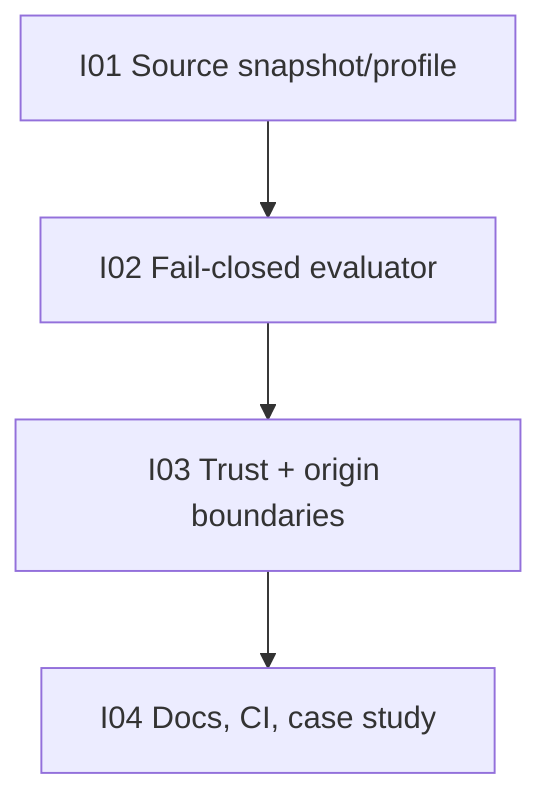

# Hypha MatrixRTC Step 1 master DAG and checklist

Status: ACTIVE — STACKED PR TRAIN, DO NOT MERGE
Canonical base: `origin/main@a6f425b91946b3177410abcadc2155bbc58feff7`
Parent initiative: https://github.com/ZenithResearch/Hypha/issues/6

## Objective

Qualify one exact, source-grounded MatrixRTC proposal-snapshot contract profile and prove that Hypha reports the current pinned SDK and production deployment as unsupported without fallback or overclaim.

## Complexity

| Scope | Total | Intrinsic | Existing | Remaining | Angles |
|---|---:|---:|---:|---:|---|
| Step 1 initiative | 13 | 13 | 5 | 8 | protocol 5; SDK 3; security/privacy 3; product/accessibility 2; QA/docs 3 |
| I01 source profile | 3 | 3 | 1 | 2 | source provenance; identifiers; SDK gap; static integrity |
| I02 qualification evaluator | 5 | 5 | 2 | 3 | typed contract; fail-closed matrix; deterministic fixtures |
| I03 trust and origin boundaries | 5 | 5 | 2 | 3 | trust; privacy; lifecycle; accessibility semantics |
| I04 public reconciliation | 3 | 3 | 1 | 2 | docs; CI; non-claims; case study |

`Existing` measures reusable reconnaissance, provenance, app authority patterns, and CI. `Remaining` is residual normalized complexity, not elapsed time.

## Governance waiver: stacked PR train

The operator forbids merge while requiring full Step 1 execution. Therefore later PRs target predecessor branches instead of waiting for merges. This is an explicit execution-only waiver; it does not make an open predecessor satisfy a normal downstream merge gate.

## Issue / PR map

| Node | Issue | Branch | Stacked base | PR | Remaining | State |
|---|---|---|---|---|---:|---|
| I01 | [#7](https://github.com/ZenithResearch/Hypha/issues/7) | `feat/matrixrtc-contract-profile` | `main` | PENDING | 2 | start-ready |
| I02 | [#8](https://github.com/ZenithResearch/Hypha/issues/8) | `feat/matrixrtc-qualification-evaluator` | `feat/matrixrtc-contract-profile` | PENDING | 3 | blocked by I01 head |
| I03 | [#9](https://github.com/ZenithResearch/Hypha/issues/9) | `feat/matrixrtc-trust-origin-contract` | `feat/matrixrtc-qualification-evaluator` | PENDING | 3 | blocked by I02 head |
| I04 | [#10](https://github.com/ZenithResearch/Hypha/issues/10) | `feat/matrixrtc-contract-reconciliation` | `feat/matrixrtc-trust-origin-contract` | PENDING | 2 | blocked by I03 head |

## Claim gates

| Claim | Proving node | Gate |
|---|---|---|
| Exact open-MSC snapshot and digests are pinned | I01 | manifest + mutation-tested verifier |
| Stable/unstable identifier profile is explicit | I01 | source/profile tests and verifier |
| Pinned/current SDK gaps are honest | I01 | provenance contract and source evidence |
| Legacy fallback cannot qualify availability | I02 | negative evaluator tests |
| Missing/stale/malformed/mixed evidence fails closed | I02 | complete rejection matrix |
| Current public production evidence is unsupported | I01 + I02 | sanitized fixture + evaluator test |
| Trust states remain distinct and terminal failures win | I03 | trust classifier tests |
| Secrets cannot enter qualification evidence | I03 | type boundary + description/redaction tests |
| Navigation cannot rebind origin authority | I03 | origin lifecycle tests |
| Unsupported semantics are accessible without UI | I03 | typed presentation tests |
| Public docs and CI preserve non-claims | I04 | docs/static/CI gates |

## Acceptance checklist

- [ ] Every child issue has complete repo-local commit specs and remaining complexity <=3.
- [ ] Every child has one reviewable stacked PR.
- [ ] Every exact head passes local and hosted CI.
- [ ] Spec, protocol, security/privacy, product/accessibility/QA, docs/quality, and Lead reviews approve every exact head.
- [ ] No PR is merged and no issue is manually closed.
- [ ] No Step 2 session/media work appears.
- [ ] Final case study and Steps 2–6 residual estimates are committed on I04.

## Non-claims

Step 1 does not prove that Hypha or the current SDK can join MatrixRTC, that production is RTC-ready, that LiveKit is authorized, that sender-key/frame encryption exists, that microphone/camera permissions are wired, or that call UI exists.
